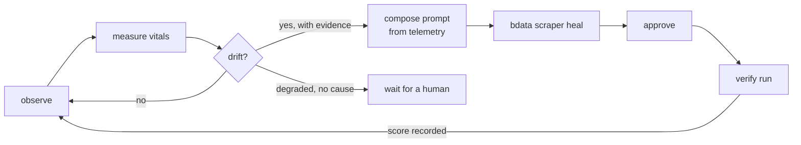

# Spinneret

**A buying-signal radar whose scrapers diagnose and repair themselves — writing their own repair prompts from telemetry, with no human describing what broke.**

Built for [Into the Scrape-Verse](https://www.wemakedevs.org/hackathons/scrape-verse) (Bright Data × WeMakeDevs, August 2026).

---

## The problem

Lead-generation pipelines do not fail loudly. A niche directory ships a redesign, a
selector stops matching, and the scraper keeps returning rows — just hollow ones.
Nobody notices for three weeks. The sales team simply reports that "leads dried up."

The failure is silent because nothing in the stack is measuring whether the data is
still *shaped* the way it was yesterday.

## What Spinneret does

Spinneret watches niche public sources for **change events** that indicate a company
is buying right now — a burst of revenue-role openings, a new entrant in a funded-startup
directory — and it treats its own scrapers as monitored assets with vital signs.

After every run it measures per-field fill rate, schema conformance and row yield
against a rolling baseline. When those numbers drift, it **composes the repair prompt
itself from the evidence it just gathered** and drives Bright Data's self-healing loop:



The last step matters most: the verification run's score is recorded next to the score
it replaced, so "self-healing worked" is a number in a ledger rather than a claim.

### Why the prompt generation is the interesting part

A heal is only as good as its prompt. The prompts that work cite specific fields,
specific magnitudes, and an explicit boundary around what must *not* change. Spinneret
has already measured all three, so it writes something like this without any human input:

> The scraper for Remote GTM job board (https://weworkremotely.com/categories/remote-sales-and-marketing-jobs)
> is returning incomplete data. Fields never returned as keys in the output: company_name,
> job_title, location, job_url. Re-derive selectors for company_name, job_title, location,
> job_url from the current live DOM and return the full contracted schema: company_name,
> job_title, location, job_url.

That is a verbatim prompt Spinneret generated and dispatched — see the heal ledger in the UI.

---

## Live collectors

Both collectors were built with Scraper Studio through `npx -p @brightdata/cli` and are
real, runnable IDs.

| Collector | ID | Target | Signal |
|---|---|---|---|
| `hiring-signals` | `c_mt4dzl5v15c84o86sa` | WeWorkRemotely GTM job board | Hiring intent — revenue roles opening |
| `funded-startups` | `c_mt4e1as4160iqj53as` | YC directory, Summer 2025 batch | New entrants, scored on sector fit |
| `product-velocity` | `c_mt4fj43j1tvgzr9bs2` | Linear changelog | Product velocity, enterprise-readiness work |

Three deliberately different shapes: a paginated job board, a JS-rendered directory,
and a single-subject changelog. They exercise different parts of the health model —
the changelog has no company field at all, so the collector names its subject instead.

**Target selection.** Every target is public, carries no personal data, sits behind no
login or paywall, and has no pre-built Bright Data scraper — the conditions the brief sets.
LinkedIn was deliberately avoided precisely *because* it already has one (`gd_l1viktl72bvl7bjuj0`);
using it would have meant not really using Scraper Studio at all.

### On the self-healing demonstration

The break shown in the demo is **not manufactured**. The `hiring-signals` collector was
created with the description *"extract every job listing: job title and company name"* and
came back returning 66 rows containing only `product_page_url` — neither contracted field
present. Spinneret's sentinel found that on its first observation, scored it **20/100**,
classified it `schema_gap`, and dispatched a heal on its own evidence.

Nothing was staged. The flight recorder holds the full before/after trace.

---

## Architecture

```
src/
├─ core/          pure domain — no I/O, fully unit-tested
│  ├─ health.ts        fill rate, schema conformance, yield → composite score
│  ├─ drift.ts         baseline comparison → severity + evidence
│  ├─ heal-prompt.ts   evidence → natural-language repair prompt
│  └─ signals.ts       rows → scored buying signals with stated rationale
├─ adapters/
│  └─ brightdata/cli.ts   the only module that spawns `bdata`
├─ db/            SQLite flight recorder + repositories (the only SQL)
├─ services/      sentinel (the loop), jobs (background), state (read model)
├─ app/api/       thin HTTP over the services, plus an SSE feed
└─ components/    dashboard
```

The interface is built on shadcn/ui with a three-font pairing (Instrument Serif for
display, Archivo for interface text, JetBrains Mono for telemetry), GSAP for the web
scaffold animation and Framer Motion for staggered reveals. Light and dark themes are
both supported; the vitals ramp darkens in light mode to hold a 4.5:1 contrast ratio.

The layering is strict and load-bearing: `core/` imports nothing from `db/`, `adapters/`
or `app/`. That is what lets the self-healing decision logic — the part that most needs to
be provable — be tested without a database, a network, or a Bright Data account.

Swapping SQLite for Postgres means rewriting `db/repositories.ts` and nothing else.

---

## Setup

Requires Node 20+ and a Bright Data account ([free tier](https://brdta.com/wemakedevs),
no card, 5,000 monthly credits).

```bash
git clone <this-repo> && cd spinneret
npm install

cp .env.example .env.local        # then paste your token into .env.local
npm run spinneret -- seed         # register the collectors
npm run dev                       # dashboard on http://localhost:3000
```

**Full documentation lives at `/docs`** once the app is running. It covers the healing
loop, the scoring arithmetic, the drift thresholds and the reasoning behind each
decision, with interactive diagrams for the loop, the health formula and the anatomy of
a real dispatched heal prompt.

`.env.local` is gitignored. Keep your token out of commits and out of any demo recording.

### Driving it from the terminal

The brief asks for the whole workflow to be runnable from inside a coding agent, so every
capability the dashboard exposes is also a command. Both call the same service layer.

```bash
npm run spinneret -- observe hiring-signals   # run + measure + diagnose
npm run spinneret -- heal hiring-signals      # compose prompt from telemetry, dispatch
npm run spinneret -- approve hiring-signals 1 # approve, re-run, record before/after
npm run spinneret -- cycle hiring-signals     # the whole loop, unattended
npm run spinneret -- status                   # fleet + heal ledger
npm test                                      # 44 unit tests over core/
```

### Running it on a schedule

```bash
npm run watch                              # default: every 30 minutes
SPINNERET_CRON="*/10 * * * *" npm run watch # or set your own
```

This is the **schedule** downstream integration: the Collector IDs are consumed by a
long-running supervisor rather than a one-off script. Each sweep observes every
collector, staggers the runs so a tick does not burst against rate limits, and heals
only where the evidence justifies it.

Two safeguards matter for unattended operation:

- **A late tick is skipped, not queued.** A sweep can outlast its own interval on a slow
  heal, and overlapping runs would corrupt the baseline.
- **A failed heal is not retried on a timer** (`src/core/cooldown.ts`). Re-sending a prompt
  already shown not to work burns credits and can degrade the scraper further. Leaving a
  collector visibly broken for a human is the better failure mode.

`cycle` is the unattended path: it observes, and heals **only if the evidence justifies it**.
A collector that is merely degraded with no identified cause is left alone deliberately —
an unfocused heal prompt tends to make a working scraper worse.

---

## How the health score works

| Component | Weight | Meaning |
|---|---|---|
| Coverage | 0.50 | Mean fill rate across contracted fields |
| Schema conformance | 0.30 | Fraction of contracted fields present as keys |
| Yield | 0.20 | Row count against the rolling baseline |

Two details that matter:

- **Baselines use the median, not the mean.** One catastrophic run would drag a mean low
  enough to mask the next real break.
- **Baselines are built only from runs that already scored well.** Otherwise the very
  degradation being detected would redefine "normal" and the break would look like an
  improvement.

`expectedFields` in `src/config/collectors.ts` is a **contract**, written independently of
what the scraper currently does. That is what lets the sentinel notice a gap nobody told it about.

---

## Signal scoring

Intent is a sum of stated rules, never a black box — every point traces to a reason shown
in the UI, because a sales team will not act on a score they cannot argue with.

Each source kind gets its own rule table, because a job title, a changelog entry and a
directory listing say different things about intent.

| Source | Rule | Points | Reasoning |
|---|---|---|---|
| hiring | GTM leadership hire | 34 | New leaders re-tool their stack within a quarter |
| hiring | RevOps hire | 32 | An explicit mandate to buy and integrate tooling |
| hiring | Revenue-carrying role | 30 | Quota capacity is being added |
| changelog | Enterprise readiness (SSO, SCIM, audit logs) | 34 | Moving upmarket, larger deals ahead |
| changelog | Integration surface | 26 | Building an ecosystem play |
| directory | B2B software | 24 | Buys tooling as a matter of course |
| any | Newly appeared | 22 | The change is fresh, not historical |
| any | Concurrent activity | up to 27 | Coordinated build-out rather than backfill |

When no rule fires, **no signal is emitted** — Spinneret never invents intent it cannot
justify. There is a test for exactly that.

---

## Data ethics

Public data only. No login-walled or paywalled sources. No personal data — signals are
company-level, derived from job postings and directory listings, and no individual's
details are collected, stored or scored.
