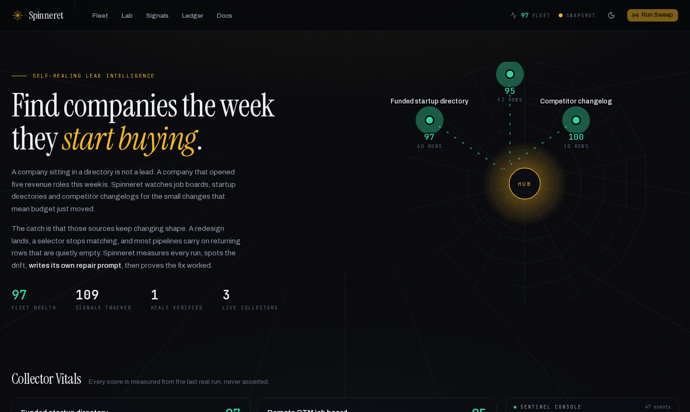
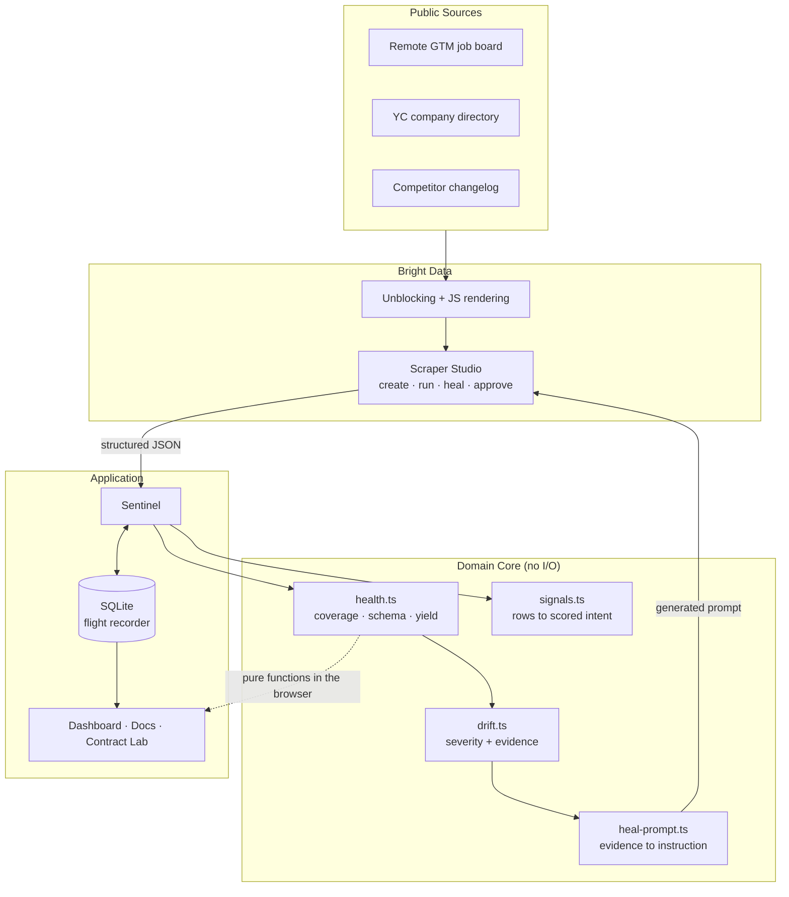
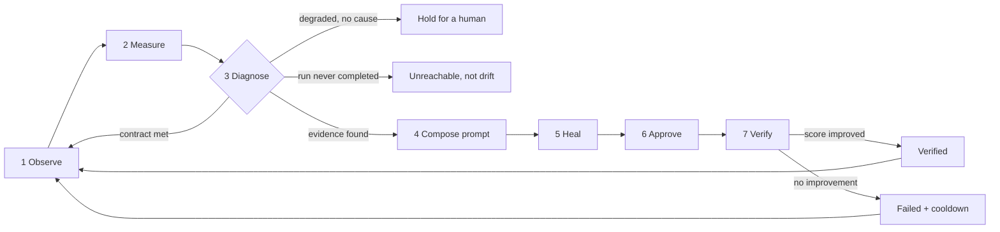
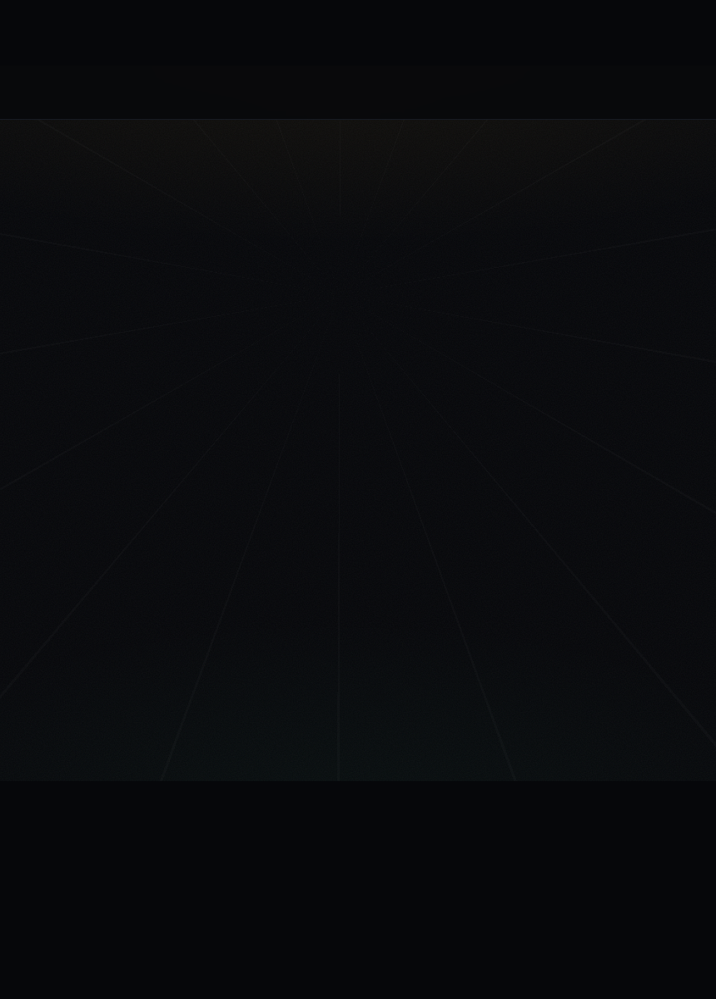
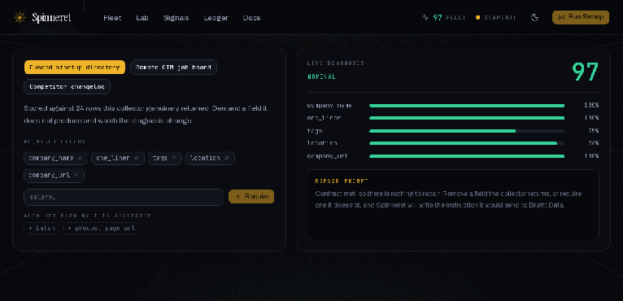
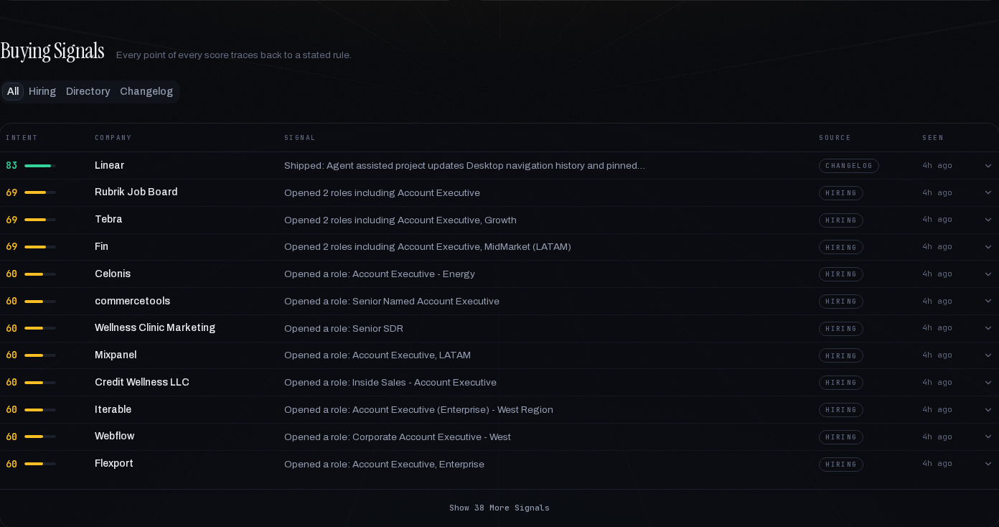
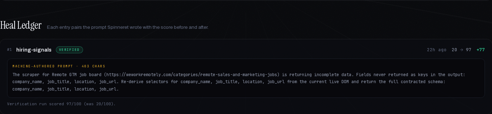
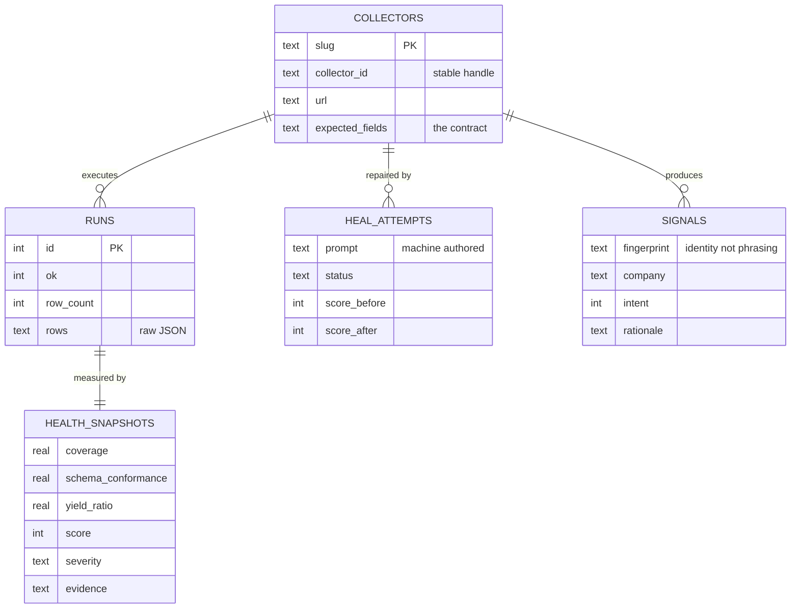
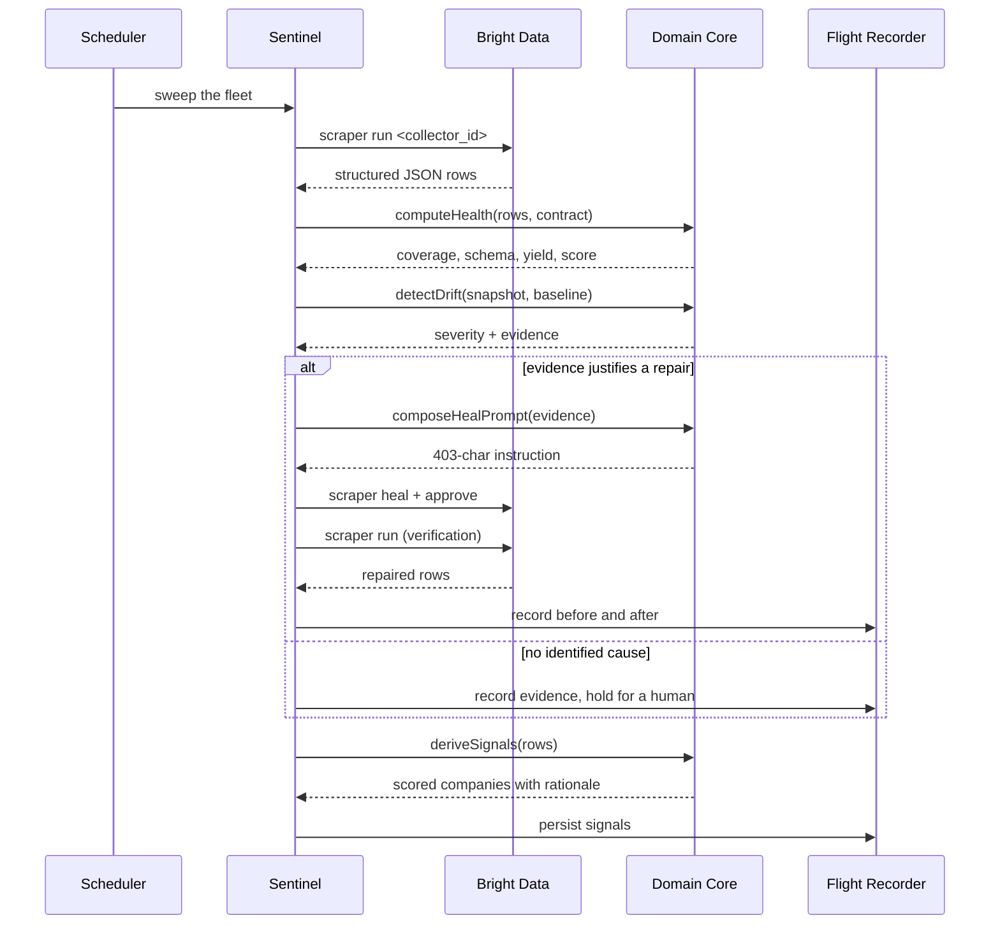

<p align="center">
  
</p>

<h1 align="center">Spinneret</h1>

<p align="center">
  <strong>Scrapers that diagnose and repair themselves.</strong><br />
  A buying-signal radar that writes its own repair prompts from telemetry,<br />
  with no human describing what broke.
</p>

<p align="center">
  
  
  
  
  
</p>

<p align="center">
  <a href="https://spinneret-pied.vercel.app"><strong>Live App</strong></a>
  ·
  <a href="https://spinneret-pied.vercel.app/docs"><strong>Documentation</strong></a>
  ·
  <a href="DEMO.md"><strong>Demo Script</strong></a>
</p>

<p align="center">
  
</p>

---

## Overview

Spinneret is two systems that need each other.

The first watches niche public sources for the moment a company commits money to
something specific, then ranks those companies by how likely they are to buy right
now, with the reasoning attached to every score.

The second keeps that feed honest. Scrapers break quietly, so after every run
Spinneret measures what came back, compares it against a contract, and when the data
stops matching it **writes its own repair prompt from those measurements**, sends it
through Bright Data Scraper Studio, approves the patch, and re-runs to prove the fix
worked.

Built for [Into the Scrape-Verse](https://www.wemakedevs.org/hackathons/scrape-verse),
the Bright Data and WeMakeDevs hackathon, August 2026.

---

## The Problem

Scrapers rarely fail loudly.

A site ships a redesign, a CSS selector stops matching, and the extraction code keeps
running perfectly. Same row count, same schedule, same green job. The rows are simply
empty.

Nothing in a normal pipeline notices. HTTP returned 200. No exception was thrown.
Three weeks later a sales team reports that leads dried up, and someone starts
bisecting a month of data to find when the values turned into nulls.

**A lead-signal product that silently goes stale is worse than no product at all**,
because it converts "I do not know" into "I am confidently wrong". Freshness is the
entire value proposition, so self-healing is not a bonus feature here. It is the thing
that makes the core promise true.

---

## Goals of the Project

| Goal | How it is met |
|---|---|
| Score change, not existence | Signals come from what shifted this week, never from a static directory dump |
| Make every score arguable | Each point traces to a stated rule, shown in the interface |
| Detect silent decay | Every run is measured against a contract written independently of the scraper |
| Repair without a human | The prompt sent to Bright Data is generated from telemetry |
| Prove the repair worked | Before and after scores are recorded side by side in a durable ledger |
| Know when not to act | Vague evidence and transport failures are explicitly excluded from healing |

---

## System Architecture Overview

Four layers with dependencies pointing one direction only. Nothing in the domain core
imports a database, a network client or a React component, which is what lets the
self-healing decision logic be unit-tested with no I/O at all.

```
src/
├─ app/, components/     interface: dashboard, docs, HTTP routes, SSE feed
├─ services/             sentinel loop, scheduler, background jobs, read model
├─ adapters/, db/        the only modules that spawn the CLI or write SQL
└─ core/                 health, drift, prompts, signals, cooldown  (imports nothing)
```

Swapping SQLite for Postgres means rewriting `db/repositories.ts` and nothing else.

---

## System Architecture Diagram



---

## The Self-Healing Loop

Seven stages. The first three run on every observation. The last four only run when
the diagnosis found evidence worth acting on.



<p align="center">
  
</p>

---

## Key Features

### Machine-Authored Repair Prompts

This is the part that separates Spinneret from a monitoring dashboard. The instruction
sent to Bright Data is assembled from measurements, not typed by a person.

```
The scraper for Remote GTM job board (https://weworkremotely.com/categories/
remote-sales-and-marketing-jobs) is returning incomplete data. Fields never
returned as keys in the output: company_name, job_title, location, job_url.
Re-derive selectors for company_name, job_title, location, job_url from the
current live DOM and return the full contracted schema: company_name,
job_title, location, job_url.
```

That is verbatim: 403 characters, generated and dispatched by the sentinel. Four
clauses, each doing a job. Name the target. State the evidence with specific fields.
Say what to do and where to look. Restate the required schema so a partial repair is
not mistaken for success.

When a collector is only partially broken, a fifth clause appears automatically,
fencing off the fields still working so a rewrite cannot regress them.

### The Contract Lab

Everything else on the dashboard is retrospective. It reports that a collector went
from 20 to 97 and asks to be believed. **The Contract Lab lets you test it.**

<p align="center">
  
</p>

Change what a collector is required to return and the whole diagnosis re-runs in front
of you. Coverage moves, evidence assembles, and the repair prompt types itself out.

None of it is simulated. The rows are ones those collectors genuinely returned, and
the scoring, drift classification and prompt composition are the same functions the
sentinel runs in production. Because the contract is the real definition of correct,
demanding a field the scraper does not produce makes it genuinely non-compliant.

It runs entirely in the browser, which is a direct payoff from the architecture: the
scoring layer performs no I/O, so it ships to the client and works on the hosted
snapshot with zero latency.

### Health Scoring

Every run produces one number between 0 and 100 from three weighted terms.

| Component | Weight | Meaning |
|---|---|---|
| Coverage | 0.50 | Mean fill rate across contracted fields |
| Schema conformance | 0.30 | Fraction of contracted fields present as keys |
| Yield | 0.20 | Row count against the rolling healthy baseline |

A value only counts if it carries information. `null`, empty strings, whitespace, and
the literal strings `"null"`, `"N/A"` and `"undefined"` all count as missing, as do
empty arrays and objects. Broken scrapers emit these constantly, and treating them as
real data is exactly how a hollow pipeline passes as healthy.

### Drift Detection

| Severity | Rule | Heals? |
|---|---|---|
| `schema_gap` | A contracted field is absent as a key | Always |
| `critical` | Composite score below 55 | Always |
| `degraded` | Score below 80, or a field regressed against baseline | Only if a specific field was identified |
| `unreachable` | The run never completed | **Never** |
| `healthy` | Everything within tolerance | No action |

The `unreachable` case matters more than it looks. A timeout returns nothing, so every
field appears absent, which is indistinguishable from a total site rewrite. Healing
that spends a cycle and hands the healing AI no live DOM to work from.

### Buying Signal Engine

<p align="center">
  
</p>

Each source type gets its own rule table, because a job title, a changelog entry and a
directory listing say different things about intent.

| Source | Rule | Points | Reasoning |
|---|---|---|---|
| hiring | GTM leadership hire | 34 | New leaders re-tool their stack within a quarter |
| hiring | RevOps hire | 32 | An explicit mandate to buy and integrate tooling |
| hiring | Revenue-carrying role | 30 | Quota capacity is being added |
| changelog | Enterprise readiness | 34 | SSO, SCIM and audit logs mean larger deals ahead |
| changelog | Integration surface | 26 | Points to an ecosystem play |
| directory | B2B software | 24 | Buys tooling as a matter of course |
| any | Newly appeared | 22 | The change is fresh, not historical |
| any | Concurrent activity | up to 27 | Coordinated build-out rather than backfill |

When no rule fires, no signal is emitted. Spinneret never invents intent it cannot
justify, and there is a unit test asserting exactly that.

### Unattended Supervision

```bash
npm run watch                                 # every 30 minutes
SPINNERET_CRON="*/10 * * * *" npm run watch    # or set your own
```

Two safeguards matter for a loop that spends money without a person watching. A sweep
can outlast its own interval during a slow heal, so a late tick is skipped rather than
queued, because overlapping runs would corrupt the shared baseline. And a heal that
ran and did not raise the score is never retried on a timer, because re-sending a
prompt already shown not to work burns credits and can degrade the scraper further.

---

## Live Collectors

Three collectors, deliberately different in shape so they exercise different parts of
the health model.

| Collector | ID | Target | Signal |
|---|---|---|---|
| `hiring-signals` | `c_mt4dzl5v15c84o86sa` | WeWorkRemotely GTM job board | Hiring intent, revenue roles opening |
| `funded-startups` | `c_mt4e1as4160iqj53as` | YC directory, Summer 2025 | New entrants, scored on sector fit |
| `product-velocity` | `c_mt4fj43j1tvgzr9bs2` | Linear changelog | Product velocity, enterprise-readiness work |

A paginated list, a JavaScript-rendered directory with an array field, and a
single-subject changelog with no company column at all. Every target is public, carries
no personal data, sits behind no login or paywall, and has no pre-built Bright Data
scraper.

**LinkedIn was deliberately avoided** precisely because it already has one
(`gd_l1viktl72bvl7bjuj0`). Using it would have meant not really using Scraper Studio.

### The self-healing demonstration was not staged

<p align="center">
  
</p>

The `hiring-signals` collector was created from the description *"extract every job
listing: job title and company name"* and came back returning 66 rows containing only
`product_page_url`. Neither contracted field was present.

Spinneret found that on its first observation, scored it **20/100**, classified it
`schema_gap`, and dispatched a heal on its own evidence. The verification run scored
**97/100**. The flight recorder holds the full trace.

---

## Tech Stack

| Layer | Choice | Why |
|---|---|---|
| Scraping | Bright Data Scraper Studio | AI-built collectors with a heal API and a stable Collector ID |
| Framework | Next.js 16, App Router | One repo for dashboard, docs and API, with SSE support |
| Language | TypeScript, strict | The domain core is the part that must be provable |
| Storage | SQLite via better-sqlite3 | Zero-config durable flight recorder, lazily required |
| UI | shadcn/ui on Base UI, Tailwind v4 | Accessible primitives, tokens remapped onto the palette |
| Motion | Framer Motion + GSAP | Staggered reveals, and the web scaffold drawn on load |
| Type | Instrument Serif, Archivo, JetBrains Mono | A deliberate pairing, not a default stack |
| Testing | Vitest | 57 unit tests over pure functions, no mocks needed |
| Scheduling | node-cron | Unattended fleet supervision |

---

## Database Design



Two details worth noting. `expected_fields` is a **contract written independently of
the scraper**, which is what lets the sentinel notice a gap nobody told it about. And
`signals.fingerprint` is derived from what was observed rather than how it was worded,
so re-observing the same job openings is silent while a genuinely new posting still
creates a signal.

---

## Application Flow



---

## Challenges & Solutions

| Challenge | Solution |
|---|---|
| A broken scraper would define its own idea of "correct" | The contract is written by hand, independently of what the scraper currently returns |
| One catastrophic run poisoning the baseline | Baselines use the median, and are built only from runs that already scored well |
| A timeout looking identical to a total site rewrite | Failed runs are classified `unreachable` and excluded from healing |
| Vague prompts making a working scraper worse | Healing is withheld unless a specific field is identified |
| A failed heal being retried forever on a timer | A pure cooldown policy blocks retries, exhaustively unit-tested |
| Re-observing creating duplicate signals | Identity is a fingerprint of what was observed, never the formatted headline |
| Serverless cannot write SQLite or run a 25-minute heal | The hosted build serves a committed JSON snapshot and says so in the header |
| A failed native build taking down the whole site | `better-sqlite3` is required lazily, so the snapshot path never loads it |

---

## Best Practices

### Architecture and Testing

The domain core imports nothing. No database, no network, no filesystem, no React.
That constraint is load-bearing: the self-healing decision logic runs in a unit test
without a Bright Data account, and the same purity is why the Contract Lab can run in
the browser. 57 tests cover the scoring, the drift thresholds, the prompt budget, the
signal rules and the retry policy.

### Reliability

Every score is measured from a real run and never asserted. A heal is only credited
once a verification run records a higher number next to the one it replaced, and the
system can report `failed`, which is what makes it trustworthy when it reports
`verified`.

### Accessibility and Design

Focus is visible everywhere, icon-only controls carry `aria-label`, the SVG fleet view
exposes an accessible description, and every animation stops under
`prefers-reduced-motion`. The vitals ramp darkens in light mode to hold a 4.5:1
contrast ratio, because those three colours are what a user reads a decision from.
Content is present in the markup and revealed under `noscript`, so a page without
JavaScript is readable rather than blank.

### Security

The API token is passed through the environment rather than a CLI flag, so it never
appears in a process listing. `.env.local` is gitignored and excluded from deployment
uploads. Only the domain core and the adapter know the token exists, and no scraped
personal data enters the system by design.

---

## Setup

Requires Node 20 or newer and a Bright Data account
([free tier](https://brdta.com/wemakedevs), no card, 5,000 monthly credits).

```bash
git clone https://github.com/hassaansaleem28/spinneret
cd spinneret
npm install

cp .env.example .env.local        # paste your Bright Data token
npm run spinneret -- seed         # register the collectors
npm run dev                       # dashboard on http://localhost:3000
```

### Watch a collector heal itself

```bash
npm run spinneret -- observe hiring-signals   # run, measure, diagnose
npm run spinneret -- heal hiring-signals      # compose a prompt, dispatch it
npm run spinneret -- approve hiring-signals 1 # approve, re-run, record the delta
```

---

## CLI Reference

Everything the dashboard can do is also a command, and both call the same service
layer rather than reimplementing each other.

```bash
npm run spinneret -- seed                          # register collectors from config
npm run spinneret -- create <url> "<description>"   # build a new collector
npm run spinneret -- observe <slug>                 # run, measure, diagnose, store
npm run spinneret -- heal <slug>                    # compose from telemetry, dispatch
npm run spinneret -- approve <slug> <healId>        # approve, verify, record
npm run spinneret -- cycle <slug>                   # the whole loop, unattended
npm run spinneret -- status                         # fleet health and recent heals
npm run watch                                       # cron supervision
npm test                                            # 57 unit tests
```

---

## Deployment

The hosted build is a **showcase, not a control plane**, and the header says
`SNAPSHOT` rather than `LIVE`.

A serverless filesystem is read-only, and a heal runs for five to twenty-five minutes
shelling out to the Bright Data CLI, far outside any request lifetime. Rather than
ship buttons that fail, the deployed build serves a committed snapshot of real runs
and disables the actions with tooltips explaining why.

```bash
npm run snapshot   # capture the live database into src/data/snapshot.json
git push           # Vercel deploys on push
```

The Contract Lab remains fully interactive on the hosted build, because the scoring
layer needs no I/O. Set `SPINNERET_READONLY=true` to reproduce hosted behaviour
locally, or `false` to force live mode anywhere.

---

## Data Ethics

Public sources only. No login-walled or paywalled content, and no personal data.

Signals are scored at company level and derived from public job postings, directory
listings and published changelogs. Spinneret does not collect, store or score details
about any individual. A job posting contributes its title and its employer, never a
named person.

---

## Conclusion

Most scraping projects treat breakage as an operational chore to be handled later.
Spinneret treats it as the central design problem, because a signal product whose data
quietly goes stale is worse than one that does not exist.

The result is a system that measures itself after every run, writes its own repair
instructions from those measurements, and records the before and after so the claim
can be audited rather than believed. One collector went from 20 to 97 that way, and
the Contract Lab exists so you can reproduce the reasoning yourself instead of taking
our word for it.

<p align="center">
  <a href="https://spinneret-pied.vercel.app"><strong>Open the live app</strong></a>
  ·
  <a href="https://spinneret-pied.vercel.app/docs"><strong>Read the docs</strong></a>
</p>
